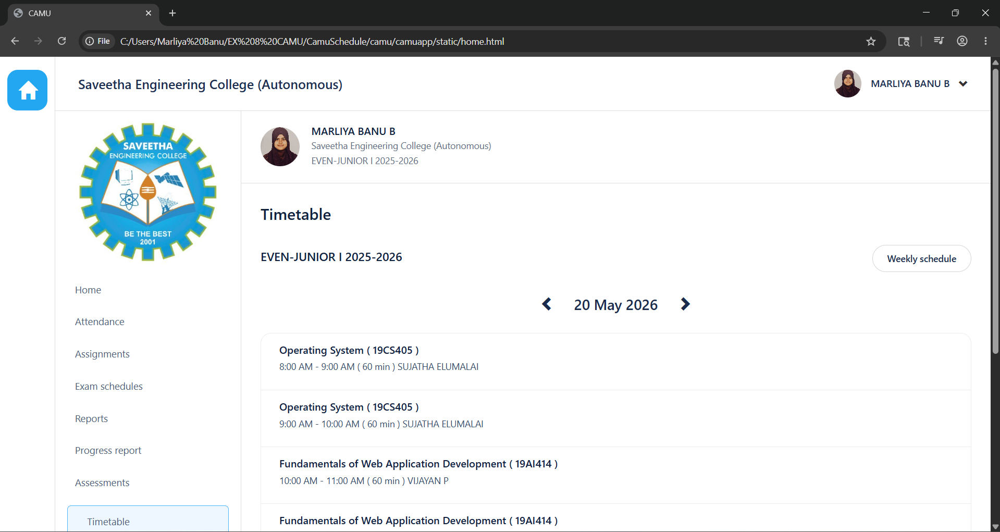
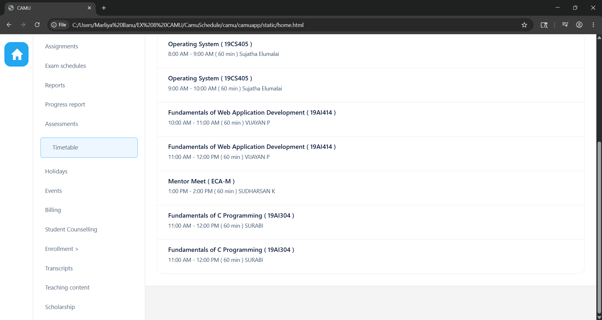

# Ex08 CAMU Schedule using Bootstrap
## Date:24-05-26

## AIM:
To design a responsive and visually appealing CAMU Schedule using Bootstrap.

## DESIGN STEPS:
### Step 1:
Clone the repository from GitHub.

### Step 2:
Create Django Admin project.

### Step 3:
Create a New App under the Django Admin project.

### Step 4:
Add the Bootstrap CDN link inside the <head> section.

### Step 5:
Insert a table element with Bootstrap table classes.

### Step 6:
Construct the complete table.

### Step 7:
Add a header/footer displaying copyright information.

### Step 8:
Publish the website in the LocalHost.

## PROGRAM :
HOME.HTML
```
<!DOCTYPE html>
<html lang="en">
<head>
<meta charset="UTF-8">
<meta name="viewport" content="width=device-width, initial-scale=1.0">
<title>CAMU </title>

<link rel="stylesheet" href="https://maxcdn.bootstrapcdn.com/bootstrap/3.4.1/css/bootstrap.min.css">
<script src="https://ajax.googleapis.com/ajax/libs/jquery/3.7.1/jquery.min.js"></script>
<script src="https://maxcdn.bootstrapcdn.com/bootstrap/3.4.1/js/bootstrap.min.js"></script>

<style>

body{
    margin:0;
    background:#f4f4f4;
    font-family:'Segoe UI',sans-serif;
    overflow-x:hidden;
}


.sidebar{
    background:white;
    height:100vh;
    border-right:1px solid #ddd;
    padding-top:20px;
    position:fixed;
    width:85px;
}

.home-btn{
    width:62px;
    height:62px;
    background:#22a7f0;
    border-radius:16px;
    margin:auto;
    display:flex;
    align-items:center;
    justify-content:center;
    color:white;
    font-size:28px;
}

.main-area{
    margin-left:85px;
}


.top-header{
    background:white;
    border-bottom:1px solid #ddd;
    padding:20px 35px;
    display:flex;
    justify-content:space-between;
    align-items:center;
}

.top-header h2{
    margin:0;
    font-size:20px;
    font-weight:600;
    color:#1d2d50;
}

.user-box{
    display:flex;
    align-items:center;
    gap:14px;
}

.user-box img{
    width:42px;
    height:42px;
    border-radius:50%;
    object-fit:cover;
}

.user-box h4{
    margin:0;
    font-size:15px;
    font-weight:600;
    color:#1d2d50;
}


.profile-section{
    background:white;
    border-bottom:1px solid #ddd;
}

.left-menu{
    width:285px;
    border-right:1px solid #ddd;
    min-height:100vh;
    float:left;
    background:white;
}

.logo{
    width:220px;
    display:block;
    margin:15px auto;
}

.menu{
    padding:0;
    margin-top:10px;
}

.menu li{
    list-style:none;
    padding:14px 30px;
    font-size:15px;
    color:#4e5d78;
    cursor:pointer;
}

.menu li:hover{
    background:#f5f9ff;
}

.active{
    border:1px solid #4cb5ff;
    margin:10px 18px;
    border-radius:6px;
    background:#eef7ff;
}


.right-content{
    margin-left:285px;
}

.profile-top{
    background:white;
    padding:22px 30px;
    border-bottom:1px solid #ddd;
    display:flex;
    align-items:center;
    gap:18px;
}

.profile-top img{
    width:60px;
    height:60px;
    border-radius:50%;
    object-fit:cover;
}

.profile-details h3{
    margin:0;
    font-size:16px;
    font-weight:600;
    color:#10213d;
}

.profile-details p{
    margin:3px 0;
    font-size:14px;
    color:#5c6b82;
}


.content{
    padding:30px;
}

.title{
    font-size:24px;
    font-weight:600;
    color:#10213d;
}

.semester{
    margin-top:35px;
    font-size:18px;
    font-weight:600;
    color:#10213d;
}

.week-btn{
    float:right;
    margin-top:-5px;
    background:white;
    border:1px solid #d5d5d5;
    border-radius:30px;
    padding:10px 22px;
    font-size:14px;
    color:#1b2b4b;
}


.date-nav{
    text-align:center;
    margin:45px 0 28px;
    font-size:22px;
    color:#1b2b4b;
    font-weight:500;
}

.date-nav span{
    margin:0 24px;
    cursor:pointer;
}


.schedule-box{
    background:white;
    border-radius:16px;
    overflow:hidden;
    border:1px solid #ececec;
}

.schedule-item{
    padding:16px 28px;
    border-bottom:1px solid #ececec;
}

.schedule-item:last-child{
    border-bottom:none;
}

.schedule-item h4{
    margin:0;
    font-size:16px;
    font-weight:600;
    color:#0f1f3d;
}

.schedule-item p{
    margin-top:7px;
    font-size:14px;
    color:#334b6b;
}

</style>

</head>

<body>


<div class="sidebar">

<div class="home-btn">
<span class="glyphicon glyphicon-home"></span>
</div>

</div>


<div class="main-area">


<div class="top-header">

<h2>Saveetha Engineering College (Autonomous)</h2>

<div class="user-box">

<!-- ADD PROFILE IMAGE -->


<h4>MARLIYA BANU B</h4>

<span class="glyphicon glyphicon-chevron-down"></span>

</div>

</div>


<div class="profile-section">


<div class="left-menu">


<ul class="menu">

<li>Home</li>
<li>Attendance</li>
<li>Assignments</li>
<li>Exam schedules</li>
<li>Reports</li>
<li>Progress report</li>
<li>Assessments</li>
<li class="active">Timetable</li>
<li>Holidays</li>
<li>Events </li>
<li>Billing</li>
<li>Student Counselling</li>
<li>Enrollment > </li>
<li>Transcripts</li>
<li>Teaching content</li>
<li>Scholarship</li>
</ul>

</div>


<div class="right-content">


<div class="profile-top">


<div class="profile-details">

<h3>MARLIYA BANU B</h3>

<p>Saveetha Engineering College (Autonomous)</p>

<p>EVEN-JUNIOR I 2025-2026</p>

</div>

</div>


<div class="content">

<div class="title">Timetable</div>

<div class="semester">

EVEN-JUNIOR I 2025-2026

<button class="week-btn">Weekly schedule</button>

</div>


<div class="date-nav">

<span class="glyphicon glyphicon-chevron-left"></span>

20 May 2026

<span class="glyphicon glyphicon-chevron-right"></span>

</div>


<div class="schedule-box">

<div class="schedule-item">

<h4>Operating System ( 19CS405 )</h4>

<p>8:00 AM - 9:00 AM ( 60 min ) SUJATHA ELUMALAI</p>

</div>

<div class="schedule-item">

<h4>Operating System ( 19CS405 )</h4>

<p>9:00 AM - 10:00 AM ( 60 min ) SUJATHA ELUMALAI</p>

</div>

<div class="schedule-item">

<h4>Fundamentals of Web Application Development ( 19AI414 )</h4>

<p>10:00 AM - 11:00 AM ( 60 min ) VIJAYAN P</p>

</div>

<div class="schedule-item">

<h4>Fundamentals of Web Application Development ( 19AI414 )</h4>

<p>11:00 AM - 12:00 PM ( 60 min ) VIJAYAN P</p>

</div>

<div class="schedule-item">

<h4>Mentor Meet ( ECA-M )</h4>

<p>1:00 PM - 2:00 PM ( 60 min ) SUDHARSAN K</p>

</div>
<div class="schedule-item">

<h4>Fundamentals of C Programming ( 19AI304 )</h4>

<p>11:00 AM - 12:00 PM ( 60 min ) SURABI </p>

</div>
<div class="schedule-item">

<h4>Fundamentals of C Programming ( 19AI304 )</h4>

<p>11:00 AM - 12:00 PM ( 60 min ) SURABI </p>

</div>

</div>

</div>

</div>

</div>

</div>

</body>
</html>
```

## OUTPUT:


## RESULT:
A responsive and visually appealing CAMU Schedule web page using Bootstrap is designed successfully.
